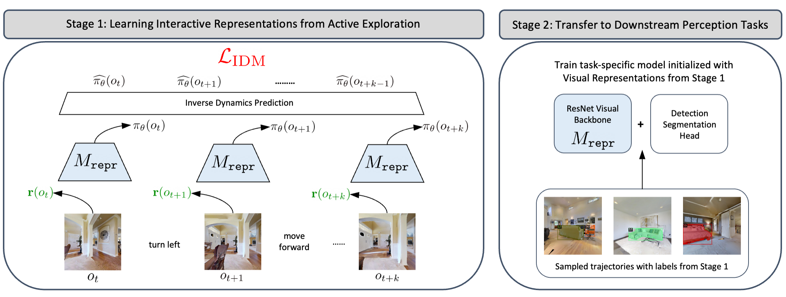
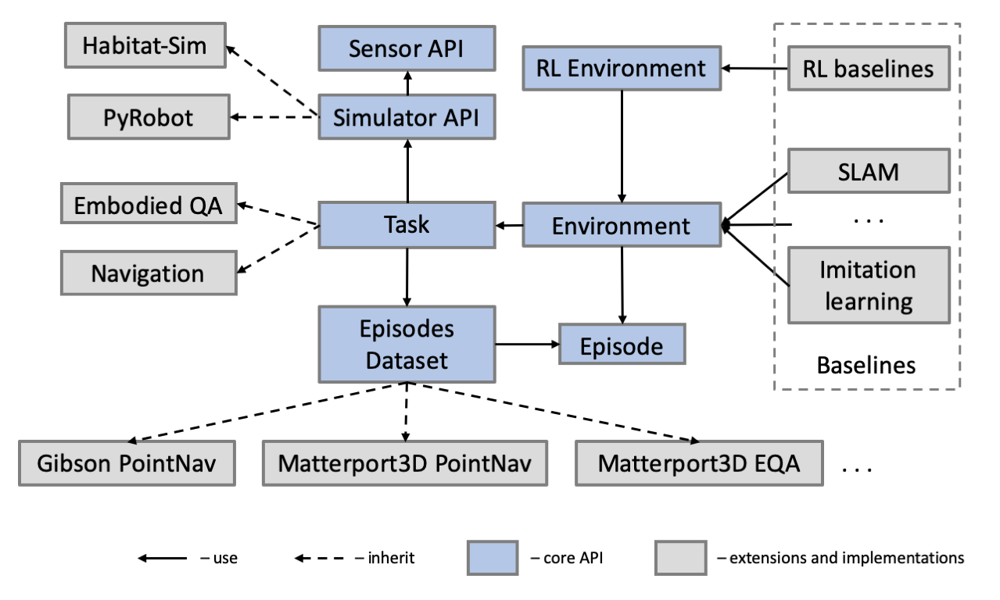

<<<<<<< HEAD
# ALP: Action-Aware Embodied Learning for Perception

Current methods in training and benchmarking vision models exhibit an over-reliance on passive, curated datasets. Although models trained on these datasets have shown strong performance in a wide variety of tasks such as classification, detection, and segmentation, they fundamentally are unable to generalize to an ever-evolving world due to constant out-of-distribution shifts of input data. Therefore, instead of training on fixed datasets, can we approach learning in a more human-centric and adaptive manner? In this paper, we introduce \textbf{A}ction-aware Embodied \textbf{L}earning for \textbf{P}erception (ALP), an embodied learning framework that incorporates action information into representation learning through a combination of optimizing policy gradients through reinforcement learning and inverse dynamics prediction objectives. Our method actively explores complex 3D environments to both learn generalizable task-agnostic representations as well as collect downstream training data. We show that ALP outperforms existing baselines in object detection and semantic segmentation. In addition, we show that by training on actively collected data more relevant to the environment and task, our method generalizes more robustly to downstream tasks compared to models pre-trained on fixed datasets such as ImageNet.



## Installation

Create conda environment with python>=3.7 and cmake>=3.10:
```bash
conda create -n alp python=3.7 cmake=3.14.0
conda activate alp
```

We use pytorch v1.10.0 and cuda 11.3:
```bash
pip install torch==1.10.0+cu113 torchvision==0.11.0+cu113 torchaudio==0.10.0+cu113 -f https://download.pytorch.org/whl/cu113/torch_stable.html
```

We use earlier version of [habitat-sim](https://github.com/facebookresearch/habitat-sim):
```bash
git clone https://github.com/facebookresearch/habitat-sim.git
cd habitat-sim; git checkout tags/v0.1.5; 
pip install -r requirements.txt 
python setup.py install --headless
```

We use custom implementation based on earlier version of [habitat-lab](https://github.com/facebookresearch/habitat-lab):
```bash
git clone --branch alp-pkg https://github.com/xinranliang/habitat-lab.git
cd habitat-lab
pip install -e .
pip install -r requirements.txt
python setup.py develop --all # install habitat-lab and habitat-baselines
```

Install [detectron2](https://github.com/facebookresearch/detectron2) from released package:
```bash
python -m pip install detectron2 -f https://dl.fbaipublicfiles.com/detectron2/wheels/cu113/torch1.10/index.html
```

Install additional dependencies:
```bash
pip install -r requirements.txt
```

Please refer to [`data/README.md`](./data/README.md) for details in setting up training and evaluation dataset.


## Running the code

### Training visual representations and exploration policy

For ALP with RND exploration, please use following scripts:
```bash
bash scripts/pretrain/run_rnd_alp.sh [CUDA_VISIBLE_DEVICES] [num_gpus_per_node]
```

For ALP with CRL exploration, please use following scripts:
```bash
bash scripts/pretrain/run_crl_alp.sh [CUDA_VISIBLE_DEVICES] [num_gpus_per_node]
```

For compute requirements, we use 5 GPUs each training 4 environment processes with 24GB memory. You could change `NUM_PROCESSES` in config.yaml files to training different numbers of environment processes in parallel.

To generate videos and maps of agent behaviors, please use following scripts:
```bash
CUDA_VISIBLE_DEVICES=[CUDA_VISIBLE_DEVICES] python src/pretrain/run_ddppo.py --exp-config configs/visualize/[AGENT].yaml --run-type eval
```
You may need to download PointNav-v1 dataset in Gibson scenes following [here](https://github.com/xinranliang/habitat-lab/tree/alp-pkg#data), and modify relative path to dataset directory and model checkpoint.

### Training and evaluating downstream perception models

Please use following scripts to train Mask-RCNN models:

```bash
CUDA_VISIBLE_DEVICES=[CUDA_VISIBLE_DEVICES] python src/mask_rcnn/plain_train_net.py \
--date [exp_date] --dataset-dir /path/to/samples_dir/ \
--pretrain-weights {random, imagenet-sup, sim-pretrain} --pretrain-path /path/to/simulator_trained_repr/ \
--num-gpus [num_gpus] --max-iter [total_train_iters] --batch-size [batch_size]
```

More specific settings and default values are listed below:
- `--dataset-dir`: relative path to folder directory that saves labeled samples from a small random subset of actively explored frames.
- `--pretrain-weights`: weight init of downstream perception model. `random` refers to random initialization and `imagenet-sup` refers to init from ImageNet supervised model trained for classification task. `sim-pretrain` initializes from visual representation pretrained in simulator; you need to provide relative path to pretrained model weights using argument `--pretrain-path`.
- `--max-iter` and `--batch-size`: we use `batch_size=32` to train on 4 GPUs each with 12GB memory.

To evaluate Mask-RCNN models, in addition to above training script, add `--eval-only` argument and provide relative path to downstream model weights using argument `--model-path`.


## Citation

If you find our code and work useful for your research, please consider citing our [paper](https://arxiv.org/abs/2306.10190):

```
@article{liang2023alp,
  title={ALP: Action-Aware Embodied Learning for Perception},
  author={Liang, Xinran and Han, Anthony and Yan, Wilson and Raghunathan, Aditi and Abbeel, Pieter},
  journal={arXiv preprint arXiv:2306.10190},
  year={2023}
}
```
=======
[](https://circleci.com/gh/facebookresearch/habitat-api)
[](https://codecov.io/gh/facebookresearch/habitat-api)
[](https://github.com/facebookresearch/habitat-api/blob/master/LICENSE)

Habitat-API
==============================

Habitat-API is a modular high-level library for end-to-end development in embodied AI --
defining embodied AI tasks (e.g. navigation, instruction following, question answering), configuring embodied agents (physical form, sensors, capabilities), training these agents (via imitation or reinforcement learning, or no learning at all as in classical SLAM), and benchmarking their performance on the defined tasks using standard metrics.

Habitat-API currently uses [`Habitat-Sim`](https://github.com/facebookresearch/habitat-sim) as the core simulator, but is designed with a modular abstraction for the simulator backend to maintain compatibility over multiple simulators. For documentation refer [here](https://aihabitat.org/habitat-api/).

We also have a dev slack channel, please follow this [link](https://join.slack.com/t/ai-habitat/shared_invite/enQtNjY1MzM1NDE4MTk2LTZhMzdmYWMwODZlNjg5MjZiZjExOTBjOTg5MmRiZTVhOWQyNzk0OTMyN2E1ZTEzZTNjMWM0MjBkN2VhMjQxMDI) to get added to the channel. If you want to contribute PRs or face issues with habitat please reach out to us either through github issues or slack channel.

[Try Habitat in your browser!](https://aihabitat.org/demo)

<p align="center">
  
</p>

---

## Table of contents
   1. [Motivation](#motivation)
   1. [Citing Habitat](#citing-habitat)
   1. [Installation](#installation)
   1. [Example](#example)
   1. [Documentation](#documentation)
   1. [Docker Setup](#docker-setup)
   1. [Details](#details)
   1. [Data](#data)
   1. [Baselines](#baselines)
   1. [License](#license)
   1. [Acknowledgments](#acknowledgments)
   1. [References](#references-and-citation)

## Motivation
While there has been significant progress in the vision and language communities thanks to recent advances in deep representations, we believe there is a growing disconnect between ‘internet AI’ and embodied AI. The focus of the former is pattern recognition in images, videos, and text on datasets typically curated from the internet. The focus of the latter is to enable action by an embodied agent in an environment (e.g. a robot). This brings to the forefront issues of active perception, long-term planning, learning from interaction, and holding a dialog grounded in an environment.

To this end, we aim to standardize the entire ‘software stack’ for training embodied agents – scanning the world and creating highly photorealistic 3D assets, developing the next generation of highly efficient and parallelizable simulators, specifying embodied AI tasks that enable us to benchmark scientific progress, and releasing modular high-level libraries to train and deploy embodied agents.

## Citing Habitat
If you use the Habitat platform in your research, please cite the following [paper](https://arxiv.org/abs/1904.01201):

```
@inproceedings{habitat19iccv,
  title     =     {Habitat: {A} {P}latform for {E}mbodied {AI} {R}esearch},
  author    =     {Manolis Savva and Abhishek Kadian and Oleksandr Maksymets and Yili Zhao and Erik Wijmans and Bhavana Jain and Julian Straub and Jia Liu and Vladlen Koltun and Jitendra Malik and Devi Parikh and Dhruv Batra},
  booktitle =     {Proceedings of the IEEE/CVF International Conference on Computer Vision (ICCV)},
  year      =     {2019}
}
```

## Installation

1. Clone a stable version from the github repository and install habitat-api using the commands below. Note that python>=3.6 is required for working with habitat-api. All the development and testing was done using python3.6. Please use 3.6 to avoid possible issues.

    ```bash
    git clone --branch stable git@github.com:facebookresearch/habitat-api.git
    cd habitat-api
    pip install -e .
    ```

    The command above will install only habitat core API. To include habitat_baselines along with all additional requirements, use the command below instead:

    ```bash
    git clone --branch stable git@github.com:facebookresearch/habitat-api.git
    cd habitat-api
    pip install -r requirements.txt
    python setup.py develop --all # install habitat and habitat_baselines
    ```

2. Install `habitat-sim` from [github repo](https://github.com/facebookresearch/habitat-sim).

3. Download the [test scenes data](http://dl.fbaipublicfiles.com/habitat/habitat-test-scenes.zip) and extract `data` folder in zip to `habitat-api/data/` where `habitat-api/` is the github repository folder.

4. Run the example script `python examples/example.py ` which in the end should print out number of steps agent took inside an environment (eg: `Episode finished after 2 steps.`). To verify that tests pass run `python setup.py test` which should print out a log about passed, skipped and failed tests.

5. Run `python examples/benchmark.py` to evaluate a forward only agent in a test environment downloaded in step-3.

## Example
<!--- Please, update `examples/example.py` if you update example. -->

Example code-snippet which uses [`tasks/pointnav.yaml`](configs/tasks/pointnav.yaml) for configuration of task and agent.

```python
import habitat

# Load embodied AI task (PointNav) and a pre-specified virtual robot
env = habitat.Env(
    config=habitat.get_config("configs/tasks/pointnav.yaml")
)

observations = env.reset()

# Step through environment with random actions
while not env.episode_over:
    observations = env.step(env.action_space.sample())

```

See [`examples/register_new_sensors_and_measures.py`](examples/register_new_sensors_and_measures) for an example of how to extend habitat-api from _outside_ the source code

## Documentation

Habitat-API documentation is available [here](https://aihabitat.org/docs/habitat-api/index.html). 

For example, see [this page](https://aihabitat.org/docs/habitat-api/quickstart.html) for a quickstart example. 


## Docker Setup
We also provide a docker setup for habitat. This works on machines with an NVIDIA GPU and requires users to install [nvidia-docker](https://github.com/NVIDIA/nvidia-docker). The following [Dockerfile](Dockerfile) was used to build the habitat docker. To setup the habitat stack using docker follow the below steps:

1. Pull the habitat docker image: `docker pull fairembodied/habitat:latest`

1. Start an interactive bash session inside the habitat docker: `docker run --runtime=nvidia -it fairhabitat/habitat:v1`

1. Activate the habitat conda environment: `source activate habitat`

1. Benchmark a forward only agent on the test scenes data: `cd habitat-api; python examples/benchmark.py`. This should print out an output like:
```bash
2019-02-25 02:39:48,680 initializing sim Sim-v0
2019-02-25 02:39:49,655 initializing task Nav-v0
spl: 0.000
```

## Details
An important objective of Habitat-API is to make it easy for users to set up a variety of embodied agent tasks in 3D environments. The process of setting up a task involves using environment information provided by the simulator, connecting the information with a dataset (e.g. PointGoal targets, or question and answer pairs for Embodied QA) and providing observations which can be used by the agents. Keeping this primary objective in mind the core API defines the following key concepts as abstractions that can be extended:

* `Env`: the fundamental environment concept for Habitat. All the information needed for working on embodied tasks with a simulator is abstracted inside an Env. This class acts as a base for other derived environment classes. Env consists of three major components: a Simulator, a Dataset (containing Episodes), and a Task, and it serves to connects all these three components together.

* `Dataset`: contains a list of task-specific episodes from a particular data split and additional dataset-wide information. Handles loading and saving of a dataset to disk, getting a list of scenes, and getting a list of episodes for a particular scene.

* `Episode`: a class for episode specification that includes the initial position and orientation of an Agent, a scene id, a goal position and optionally shortest paths to the goal. An episode is a description of one task instance for the agent.

<p align="center">
  
  <p align="center"><i>Architecture of Habitat-API</i></p>
</p>

* `Task`: this class builds on top of the simulator and dataset. The criteria of episode termination and measures of success are provided by the Task.

* `Sensor`: a generalization of the physical Sensor concept provided by a Simulator, with the capability to provide Task-specific Observation data in a specified format.

* `Observation`: data representing an observation from a Sensor. This can correspond to physical sensors on an Agent (e.g. RGB, depth, semantic segmentation masks, collision sensors) or more abstract sensors such as the current agent state.

Note that the core functionality defines fundamental building blocks such as the API for interacting with the simulator backend, and receiving observations through Sensors. Concrete simulation backends, 3D datasets, and embodied agent baselines are implemented on top of the core API.

## Data
To make things easier we expect `data` folder of particular structure or symlink presented in habitat-api working directory.

### Scenes datasets
| Scenes models | Extract path | Archive size |
| --- | --- | --- |
| [Gibson](#Gibson) | `data/scene_datasets/gibson/{scene}.glb` | 1.5 GB |
| [MatterPort3D](#Matterport3D) | `data/scene_datasets/mp3d/{scene}/{scene}.glb` | 15 GB |

#### Matterport3D
The full Matterport3D (MP3D) dataset for use with Habitat can be downloaded using the official [Matterport3D](https://niessner.github.io/Matterport/) download script as follows: `python download_mp.py --task habitat -o data/scene_datasets/mp3d/`. You only need the habitat zip archive and not the entire Matterport3D dataset. Note that this download script requires python 2.7 to run. Extract the matterport data to `data/scene_datasets/mp3d`.

#### Gibson
Download the Habitat related Gibson dataset following the instructions [here](https://github.com/StanfordVL/GibsonEnv#database). After downloading extract the dataset to folder `habitat-api/data/scene_datasets/gibson/` folder (this folder should contain the `.glb` files from Gibson).


### Task datasets
| Task | Scenes | Link | Extract path | Config to use | Archive size |
| --- | --- | --- | --- | --- | --- |
| [Point goal navigation](https://arxiv.org/abs/1807.06757) | Gibson | [pointnav_gibson_v1.zip](https://dl.fbaipublicfiles.com/habitat/data/datasets/pointnav/gibson/v1/pointnav_gibson_v1.zip) | `data/datasets/pointnav/gibson/v1/` |  [`datasets/pointnav/gibson.yaml`](configs/datasets/pointnav/gibson.yaml) | 385 MB |
| [Point goal navigation corresponding to Sim2LoCoBot experiment configuration](https://arxiv.org/abs/1912.06321) | Gibson | [pointnav_gibson_v2.zip](https://dl.fbaipublicfiles.com/habitat/data/datasets/pointnav/gibson/v2/pointnav_gibson_v2.zip) | `data/datasets/pointnav/gibson/v2/` |  [`datasets/pointnav/gibson_v2.yaml`](configs/datasets/pointnav/gibson.yaml) | 274 MB |
| [Point goal navigation](https://arxiv.org/abs/1807.06757) | MatterPort3D | [pointnav_mp3d_v1.zip](https://dl.fbaipublicfiles.com/habitat/data/datasets/pointnav/mp3d/v1/pointnav_mp3d_v1.zip) | `data/datasets/pointnav/mp3d/v1/` | [`datasets/pointnav/mp3d.yaml`](configs/datasets/pointnav/mp3d.yaml) | 400 MB |
| Object goal navigation | MatterPort3D | [objectnav_mp3d_v1.zip](https://dl.fbaipublicfiles.com/habitat/data/datasets/objectnav/m3d/v1/objectnav_mp3d_v1.zip) | `data/datasets/objectnav/mp3d/v1/` | [`datasets/objectnav/mp3d.yaml`](configs/datasets/objectnav/mp3d.yaml) | 170 MB |
| [Embodied Question Answering](https://embodiedqa.org/) | MatterPort3D | [eqa_mp3d_v1.zip](https://dl.fbaipublicfiles.com/habitat/data/datasets/eqa/mp3d/v1/eqa_mp3d_v1.zip) | `data/datasets/eqa/mp3d/v1/` | [`datasets/eqa/mp3d.yaml`](configs/datasets/eqa/mp3d.yaml) | 44 MB |
| [Visual Language Navigation](https://bringmeaspoon.org/) | MatterPort3D | [vln_r2r_mp3d_v1.zip](https://dl.fbaipublicfiles.com/habitat/data/datasets/vln/mp3d/r2r/v1/vln_r2r_mp3d_v1.zip) | `data/datasets/vln/mp3d/r2r/v1` | [`datasets/vln/mp3d_r2r.yaml`](configs/datasets/vln/mp3d_r2r.yaml) | 2.7 MB |

To use an episode dataset provide related config to the Env in [the example](#example) or use the config for [RL agent training](habitat_baselines/README.md#reinforcement-learning-rl).

## Baselines
Habitat-API includes reinforcement learning (via PPO) and classical SLAM based baselines. For running PPO training on sample data and more details refer [habitat_baselines/README.md](habitat_baselines/README.md).

## Habitat-PyRobot
Habitat-API supports deployment of models on a physical robot through PyRobot (https://github.com/facebookresearch/pyrobot). Please install the python3 version of PyRobot and refer to `habitat.sims.pyrobot.pyrobot` for instructions. This functionality allows deployment of models across simulation and reality.

## Acknowledgments
The Habitat project would not have been possible without the support and contributions of many individuals. We would like to thank Dmytro Mishkin, Xinlei Chen, Georgia Gkioxari, Daniel Gordon, Leonidas Guibas, Saurabh Gupta, Or Litany, Marcus Rohrbach, Amanpreet Singh, Devendra Singh Chaplot, Yuandong Tian, and Yuxin Wu for many helpful conversations and guidance on the design and development of the Habitat platform.

## License
Habitat-API is MIT licensed. See the [LICENSE file](habitat_baselines/LICENSE) for details.

The trained models and the task datasets are considered data derived from the correspondent scene datasets.
- Matterport3D based task datasets and trained models are distributed with [Matterport3D Terms of Use](http://kaldir.vc.in.tum.de/matterport/MP_TOS.pdf) and under [CC BY-NC-SA 3.0 US license](https://creativecommons.org/licenses/by-nc-sa/3.0/us/).
- Gibson based task datasets and trained models are distributed with [Gibson Terms of Use](https://storage.googleapis.com/gibson_material/Agreement%20GDS%2006-04-18.pdf) and under [CC BY-NC-SA 3.0 US license](https://creativecommons.org/licenses/by-nc-sa/3.0/us/).

## References and Citation
1. [Habitat: A Platform for Embodied AI Research](https://arxiv.org/abs/1904.01201). Manolis Savva, Abhishek Kadian, Oleksandr Maksymets, Yili Zhao, Erik Wijmans, Bhavana Jain, Julian Straub, Jia Liu, Vladlen Koltun, Jitendra Malik, Devi Parikh, Dhruv Batra. IEEE/CVF International Conference on Computer Vision (ICCV), 2019.
>>>>>>> habitat-lab
